# 3D Printed Compliant Actuator
(Referred to as *The Shactuator* in various remote regions of the world.)

A compact, high-performance open-source actuator for advanced robotics, designed and built to explore fundamental principles of electronics, motors, and gearboxes for applications like the humanoids and robotic dogs.

  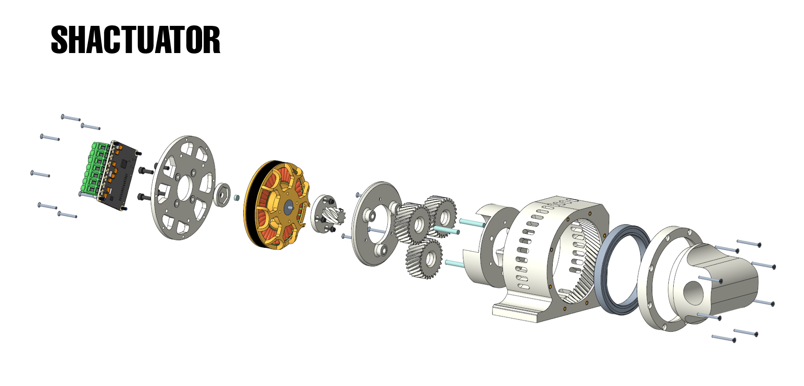
   
  <em>Figure 1: An exploded view of the Shactuator.</em>

---

## Table of Contents
* [Introduction](#introduction)
* [Project Goals & Requirements](#project-goals--requirements)
* [Design Philosophy: Gearbox Selection](#design-philosophy-gearbox-selection)
    * [Gear Ratio Calculation](#gear-ratio-calculation)
* [Core Components & Bill of Materials](#core-components--bill-of-materials)
* [Mechanical Design & CAD](#mechanical-design--cad)
    * [Overall Assembly](#overall-assembly)
    * [Key Subassemblies](#key-subassemblies)
    * [Design Notes](#design-notes)
* [Manufacturing & 3D Printing Notes](#manufacturing--3d-printing-notes)
* [Assembly](#assembly)
* [Electronics & Control Setup](#electronics--control-setup)
    * [ODrive Tuning](#odrive-tuning)
* [Testing & Performance](#testing--performance)
    * [Max Torque Test](#max-torque-test)
    * [Compliance & Backdrivability](#compliance--backdrivability)
    * [Speed Tests](#speed-tests)
    * [Continuous Torque Test](#continuous-torque-test)
    * [Backlash Evaluation](#backlash-evaluation)
* [Challenges & Lessons Learned](#challenges--lessons-learned)
    * [Power Supply Limitations](#power-supply-limitations)
    * [Material Strain](#material-strain)
* [Future Improvements](#future-improvements)

---

## Introduction

This project explores the design and fabrication of a custom, high-torque-density actuator, dubbed the "Shactuator," leveraging a 3D printed gearbox, and low cost brushless DC motors, and a an ODrive motor controllerr. My distant goal is to build a robtoic dog or humanoid, but you can't do that without validating an actuator design. Naturally, that led me to design and construct our my actuators to deepen my understanding of electronics, motors, and gearboxes. By getting my hands dirty with these foundational elements of applied robotics, I aimed to gain a comprehensive understanding of the root components essential for millions of applications.

## Project Goals & Requirements

The development of the Shactuator was guided by several key objectives:
* **High Torque Density:** Design an actuator capable of delivering substantial torque relative to its size. Must deliver at least 5 ft-lbs of torque.
* **Compliance & Backdrivability:** Ensure the actuator can yield to external forces and be backdriven, a critical feature for safe and dynamic robotic interaction.
* **3D Print Feasibility:** Leverage 3D printing for rapid prototyping and cost-effectiveness in manufacturing components.
* **Cost-Effectiveness:** Utilize readily available and affordable components, where possible.
* **Learning Objectives:** Provide a robust platform for learning about BLDC motor control, gearbox design, and mechatronic system integration.

## Design Philosophy: Gearbox Selection

When embarking on the design of a custom actuator, selecting the appropriate gearbox type is paramount. I considered three primary options: Planetary, Cycloidal, and Harmonic drives, each with its unique trade-offs in terms of performance, complexity, and manufacturability. To justify my decision, I conducted a weighted trade study:

| Criterion              | Harmonic                               | Planetary                          | Cycloidal                          | Notes                                           |
| :--------------------- | :------------------------------------- | :--------------------------------- | :--------------------------------- | :---------------------------------------------- |
| Backlash               | 3                                      | 4                                  | 5 (Excellent)                      |                                                 |
| Torque Density         | 5 (Excellent)                          | 4                                  | 3                                  |                                                 |
| Efficiency             | 4                                      | 2                                  | 5 (Excellent)                      | 5 H will have significant friction if printed   |
| Shock Load Capacity    | 2                                      | 4                                  | 5 (Excellent)                      | 5 H can fail if heavily shocked: Not good for Dog|
| Design Complexity      | 2                                      | 5 (Excellent)                      | 1                                  |                                                 |
| 3D Print Feasibility   | 3                                      | 5 (Excellent)                      | 1                                  |                                                 |
| **Rating (Average)** | **3.17** | **4.00** | **3.33** |                                                 |

I ultimately opted for a **planetary gearbox system**. While Cycloidal and Harmonic drives offer superior efficiency and backlash characteristics, their increased design and printing complexity presented a significant hurdle for a proof-of-concept project. I wanted to move fast. My primary goal was to validate the overall actuator concept rather than delve into the intricacies of perfecting highly complex 3D-printed cycloidal or harmonic drives. Planetary gearboxes strike a favorable balance, offering sufficient efficiency and ease of fabrication, which was crucial for rapid prototyping.
(The full trade is uploaded: `DESIGN/Gearbox Trade.xlsx`)

### Gear Ratio Calculation

The gearbox was meticulously designed to achieve an **8:1 gear ratio**, effectively multiplying the motor's output torque by eight. I chose helical gears over spur gears because they provide a smoother and quieter operation due to the gradual engagement of teeth and larger surface area of engagement. More importantly, they offer a higher load capacity by distributing the load across multiple teeth simultaneously. This was a critical consideration given the use of PLA for printed components, as it adds a valuable safety factor by spreading the load and mitigating potential stress concentrations.

  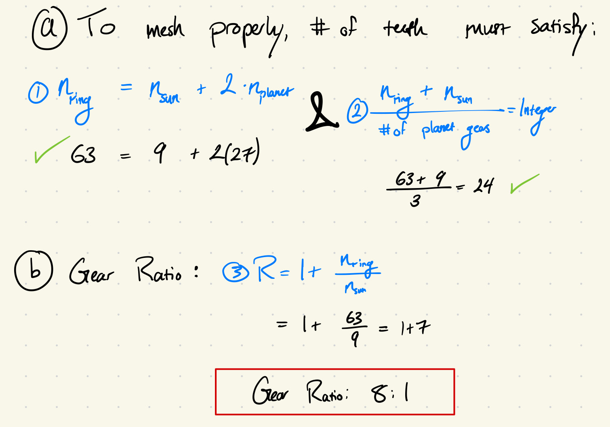
   
  <em>Figure 2: Detailed calculations for the 8:1 helical planetary gearbox ratio and number of teeth selection, ensuring proper meshing and desired reduction.</em>

## Core Components & Bill of Materials

The Shactuator integrates a select set of components, chosen for their performance, availability, and suitability for the project's goals.

* **EaglePower 8308 KV90 Brushless Motor:** Designed for agricultural drones, this motor was a strategic choice due to its compelling balance of characteristics. It offers a **low profile** ideal for compact actuator designs, delivers **relatively high performance** suitable for dynamic robotic applications, and comes at a **good price** ($69.09 from AliExpress), making it an accessible option for a custom build.
    * **Specifications:** Size: 3.62” Dia, 1.12” height; 0.741 lbs; Max Continuous Current 22A; 20 pole pairs. KV90: means it can rotate at an RPM of 90 * Voltage Provided
* **ODrive S1 Controller**: This advanced motor controller is the brains of the operation, chosen for its robust capabilities in precisely managing brushless DC motor commutation and control ($169.73 from ODrive Robotics). Its sophisticated control algorithms enable the high performance and compliant behavior demonstrated by the Shactuator.
* **Encoder Magnet**: Essential for precise position feedback, this Neodymium magnet is designed to work seamlessly with the ODrive S1's onboard encoder. It provides the necessary magnetic field for the controller to accurately track the motor's rotational position.
* **Radial Bearings:** The selection of my bearings was primarily driven by their **wide availability** and **low cost**, ensuring that replacement or sourcing for replication remains straightforward and economical. They provide the necessary support and smooth operation for the moving parts within the gearbox.
* **Other components:** Including 4-40 Keenserts, M5x30 steel dowel pins, and various screws, are detailed in the full BOM.

**Total Project Cost (Components): $282.49**

*The full Bill of Materials (BOM) is detailed below, including component names, quantities, costs, and sourcing information can be found in the project files as an Excel sheet named `Shactuator BOM.xlsx`.*

## Mechanical Design & CAD

The Shactuator's mechanical design emphasizes modularity, enabling ease of assembly, maintenance, and potential future modifications. The entire actuator is ingeniously composed of four main assemblies, meticulously designed to slip together. This modular approach significantly streamlines the construction process and offers flexibility for iterating on specific components.

  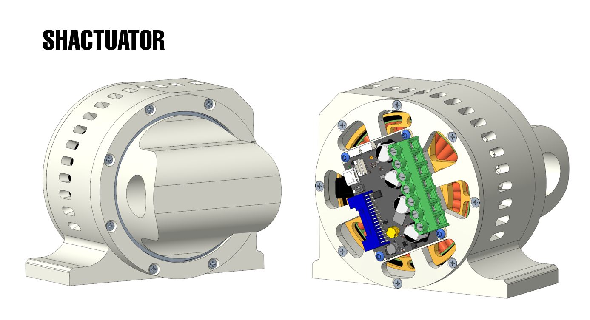
   
  <em>Figure 3: The fully assembled Shactuator, showcasing its compact form factor and integrated design.</em>

### Overall Assembly

The Shactuator consists of 4 main assemblies that slip together for streamlined integration and maintenance.

### Key Subassemblies

  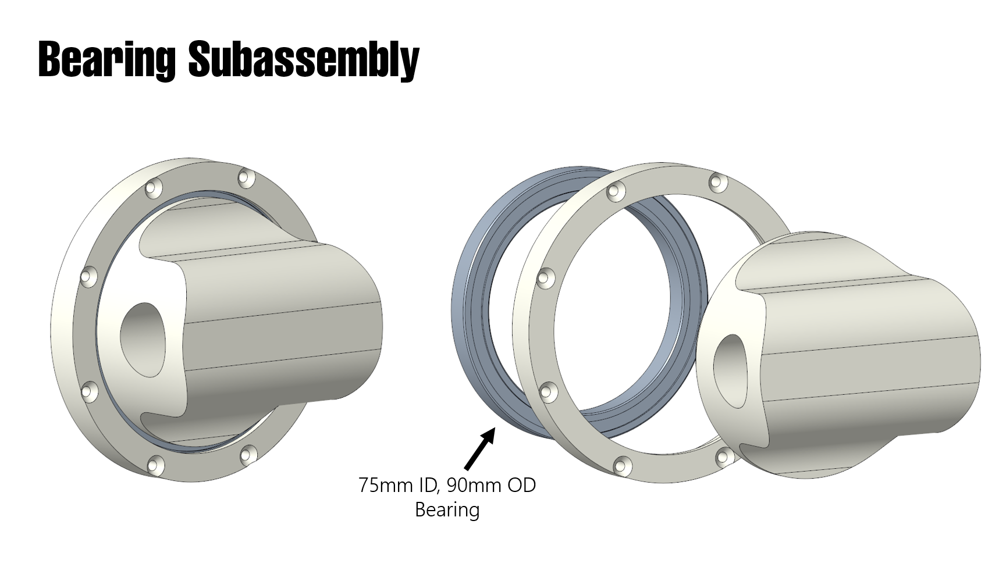
   
  <em>Figure 4: Exploded view of the Bearing Subassembly, highlighting the 75mm ID, 90mm OD bearing that supports the actuator's output shaft.</em>

**End Effector and Bearing**: This assembly forms the primary output of the actuator. It houses the output bearing and customizable end effector. Designed with various end effector versions, it facilitates rapid testing and minimizes potential sources of error. The default design allows for direct mounting of these end effectors.
 
    

  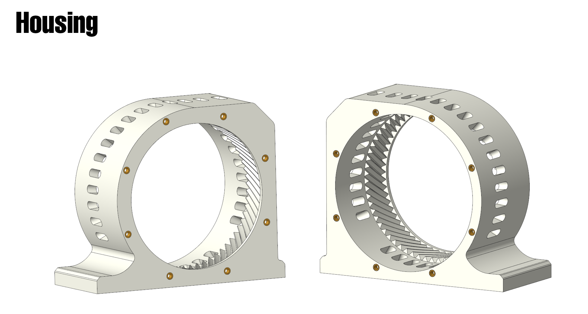
   
  <em>Figure 5: The Housing Assembly, which functions as the ring gear and actuator shroud, showing its internal helical gear teeth and integrated cooling provisions, and #4-40 inserts.</em>

**Actuator Housing**: This critical component serves a dual purpose: it functions as the stationary **ring gear** for the planetary system and acts as a protective shroud for the entire internal assembly. Integrated holes provide passive cooling to dissipate heat generated during operation. I modified the structure to give firm clamping points (my initial testing was pushing the actuator to its ends, slipping from the clamps during limit testing).
 

  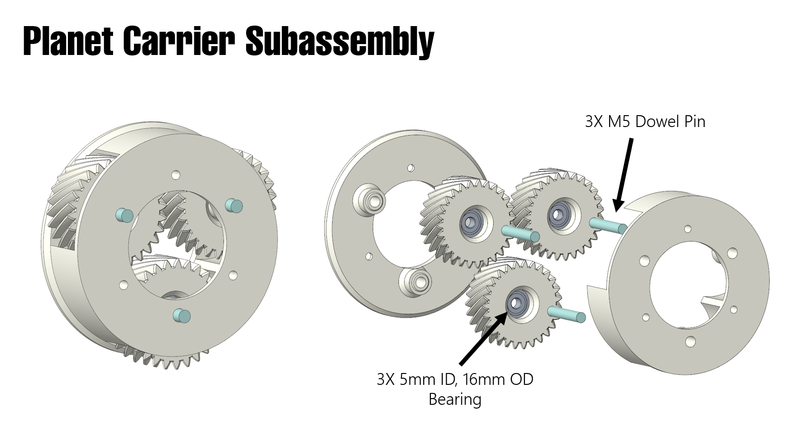
   
  <em>Figure 6: The Planet Carrier Subassembly, showing the arrangement of planet gears, 3x M5 dowel pins, and 3x 5mm ID, 16mm OD bearings, crucial for smooth planetary motion.</em>

**Planetary Carriers**: This subassembly houses the planet gears. It incorporates steel dowel pins and small roller bearings alongside the gears, ensuring smooth and efficient power transmission. 
 

  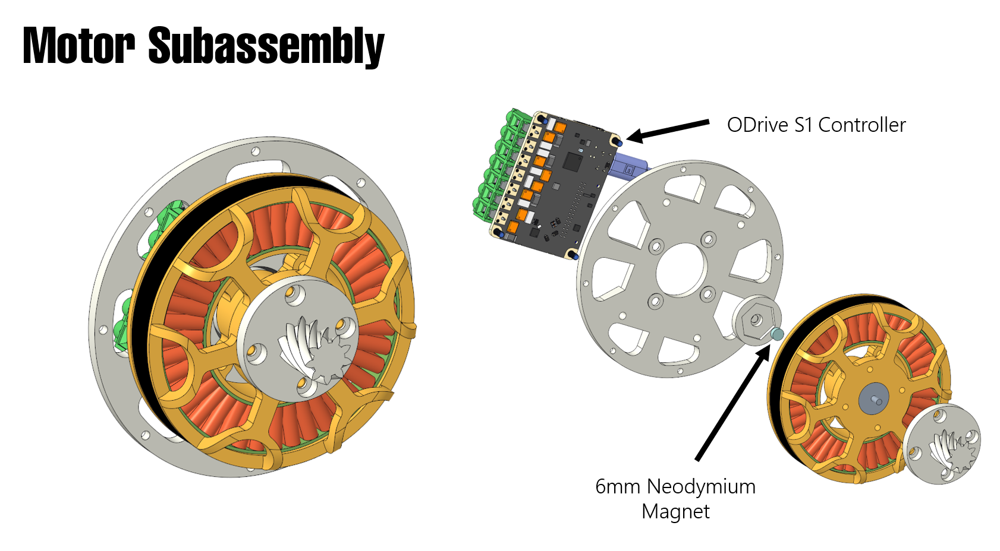
   
  <em>Figure 7: The Motor Subassembly, illustrating the brushless motor, sun gear attachment, ODrive S1 controller, and the 6mm Neodymium magnet used for encoder feedback.</em>

**Motor Subassembly**: This assembly integrates the EaglePower brushless motor with the **sun gear**. The motor is securely attached to a back plate, which also provides mounting provisions for the ODrive S1 controller (and its onboard encoder). Precise positioning of the ODrive is essential to ensure optimal alignment with the onboard encoder and magnet for accurate position feedback.
 
 
The CAD models (STP files) for the Shactuator, including all assemblies and individual components, are attached to this repository. These models provide comprehensive details for replication, modification, or further development.

### Design Notes

* Variations for different end effectors were used in the design process, streamlining testing procedures and minimizing potential error sources. I uploaded the CAD with a slot for 1" Rod for your testing and validation purposes.
* The actuator housing integrates passive cooling holes to help manage heat during operation.
* The ODrive S1 controller's mounting provisions are carefully designed to ensure the critical 0.5-3mm spacing from the motor's magnet for reliable onboard encoder operation. More on this below.
  
## Manufacturing & 3D Printing Notes

Utilizing FDM 3D printing for the Shactuator's components brought both advantages and specific considerations:

* **Press-Fit Tolerances:** When designing circular press-fit parts, such as bearing seats on 3D printed components, I noticed that oversizing the printed part by **1-2%** generally yields an optimal interference fit. This helps compensate for common 3D printing dimensional inaccuracies and ensures secure seating of components.
* **Mid-Print Bearing Insertion:** For the planetary carriers, a unique assembly step was required: the 3D print had to be paused partway through its fabrication to allow for the precise insertion of the small roller bearings. This ensures the bearings are fully encapsulated within the printed structure.

  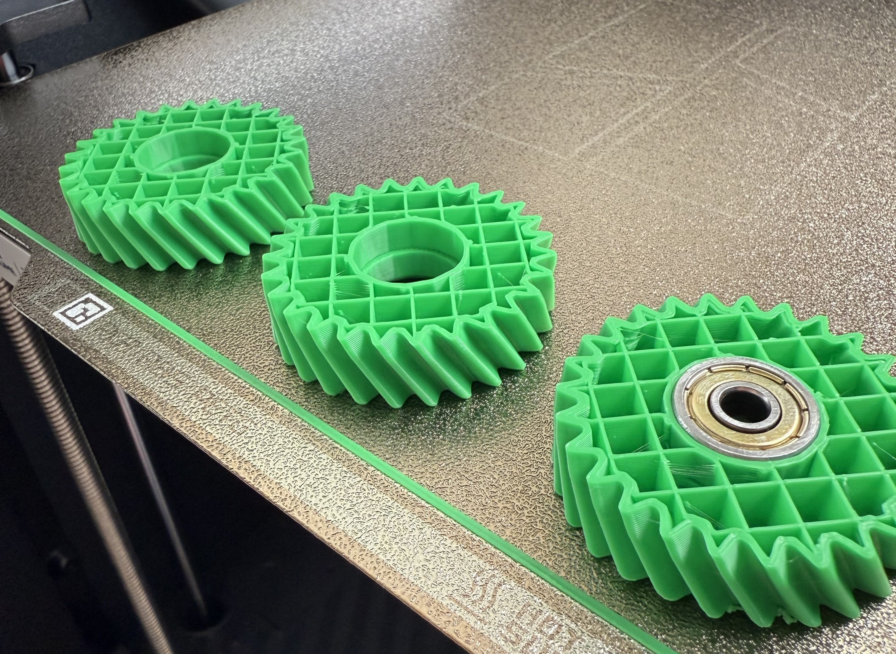
   
  <em>Figure 9: Key Assembly Note: Press Fitting the radial bearings into the gears mid-print.
.</em>

## Assembly

The assembly process for the Shactuator was significantly simplified by its modular design, allowing for a logical and systematic integration of components.

  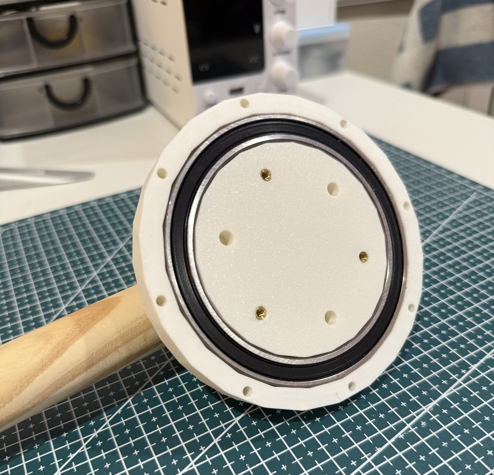
   
  <em>Figure 9: Initial assembly phase, showing the integration of the main bearing into the housing, highlighting the wooden rod used for stability during early tests.</em>

  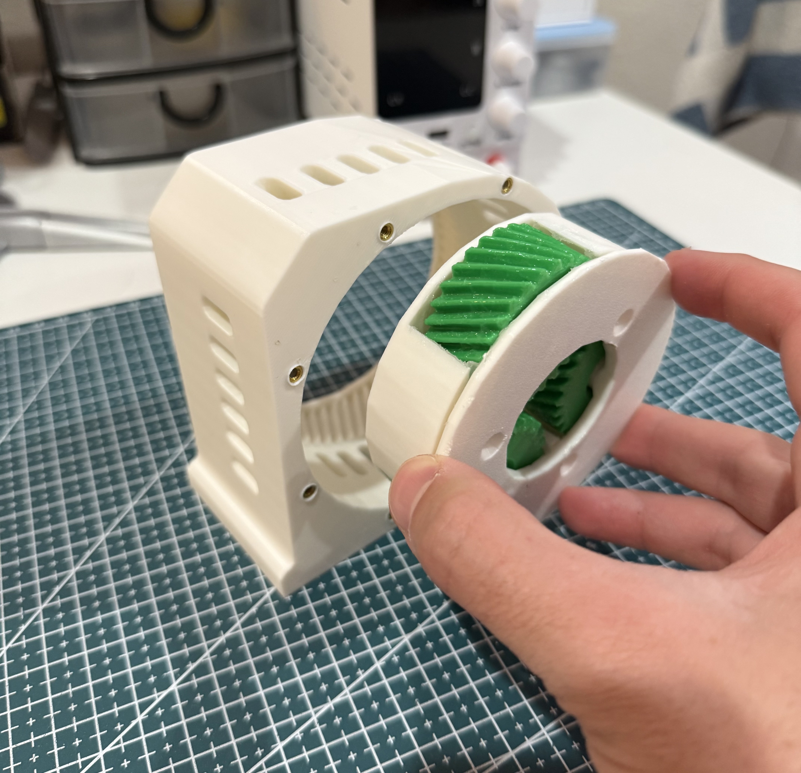
   
  <em>Figure 10: Assembling the planetary carrier subassembly into the main housing, showcasing the helical planet gears.</em>

  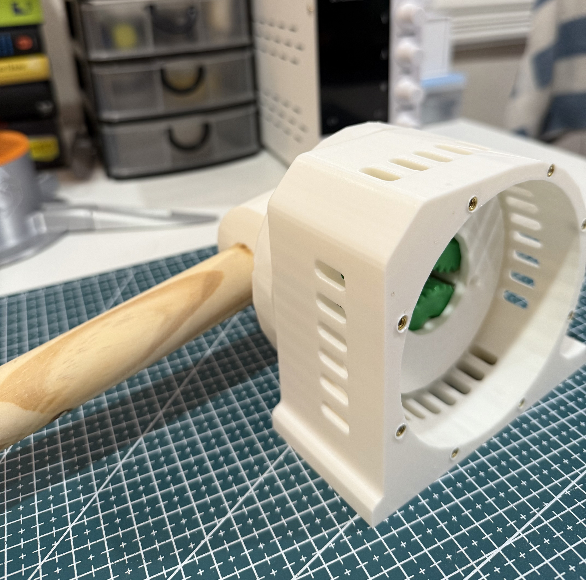
   
  <em>Figure 11: The actuator assembly with the wooden rod fully integrated, demonstrating the early testing setup.</em>

## Electronics & Control Setup

The Shactuator's intelligent control is handled by the **ODrive S1 Controller**, which precisely manages the EaglePower brushless motor. For position feedback, the motor leverages its onboard encoder in conjunction with a 6mm Neodymium magnet. Crucially, the [ODrive Technical Specification](https://docs.odriverobotics.com/v/latest/articles/magnetic-encoders.html#design-consideration) recommends maintaining a spacing of **0.5 to 3mm** between the top surface of the encoder IC and the magnet for optimal performance and signal integrity.

  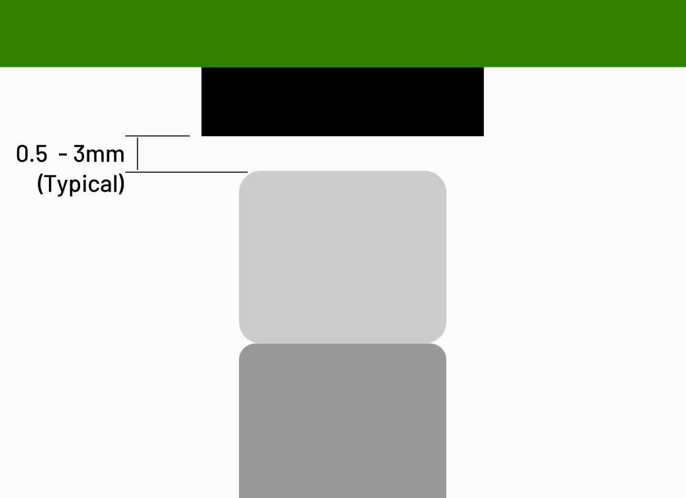
   
  <em>Figure 13: The spaceing between the top surface of the onboard encoder and the face of the magnet should be 0.5 - 3mm for optimal position sensing.</em>

During the testing and tuning phases, control was exclusively managed via the **ODrive Dashboard**. This intuitive graphical user interface allowed for direct setting of motor positions, velocities, or torques, eliminating the need for custom coding to conduct performance assessments.

### ODrive Tuning

Optimal performance of the Shactuator was achieved through careful tuning of the ODrive S1 controller's proportional-integral-derivative (PID) gains, referencing the comprehensive ODrive Documentation. The following gain values provided the best results for actuator response and damping characteristics:

* **Position Gain:** 156 (rev/s)/rev)
* **Velocity Gain:** 0.552 Nm/(rev/s)
* **Velocity Integrator Gain:** 0.05 (Nm/s)/(rev/s)

  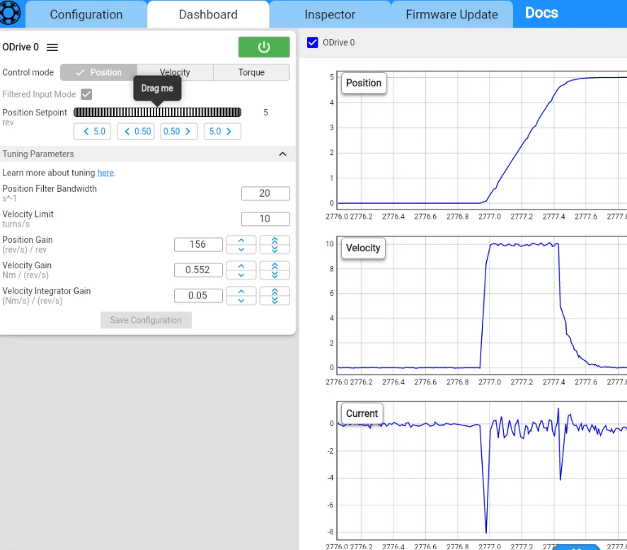
   
  <em>Figure 14: Screenshot of the ODrive Dashboard showing the configured PID gain values (Position, Velocity, and Velocity Integrator Gain) and the resultant position, velocity, and current damping curves during testing.</em>

## Testing & Performance

Rigorous testing was conducted to characterize the Shactuator's performance across various parameters, providing valuable insights into its capabilities and limitations.

### Max Torque Test
* **Expected:** Using the motor speed and current, I used a given formula found in a textbook to calculate the expected torque of brushless DC motors. Thus, at 20A, I was expecting **11.68 ft-lbs**.

  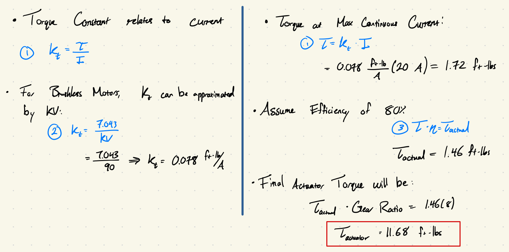
   
  <em>Figure 16: Detailed motor torque calculations, including the derivation of the torque constant (kt) and the final actuator torque, incorporating an assumed 80% efficiency for the system.</em>

* **Methodology:** The actuator's maximum torque output was assessed using a handheld force gauge at a marked distance from the actuator's rotation axis.
* **Results:** In the low current limit stages, the actuator exhibited linear behavior, with actual torque closely aligning with the theoretical $T = (k_t)(I)$ relationship. However, from 15A and beyond, a noticeable deviation from the expected linear trend was observed, indicating some loss. This phenomenon is commonly attributed to material friction losses (e.g., from bearings or gear meshing) and heat generation, particularly at higher torques and currents, a finding consistent with [existing motor torque literature](https://www.controleng.ca/servosoft/SSHelp1033/source/MotorTorqueVsCurrent.htm).

  
   
  <em>Figure 15: The actuator's maximum torque output was assessed using a handheld force gauge at a marked distance from the actuator's rotation axis. </em>

  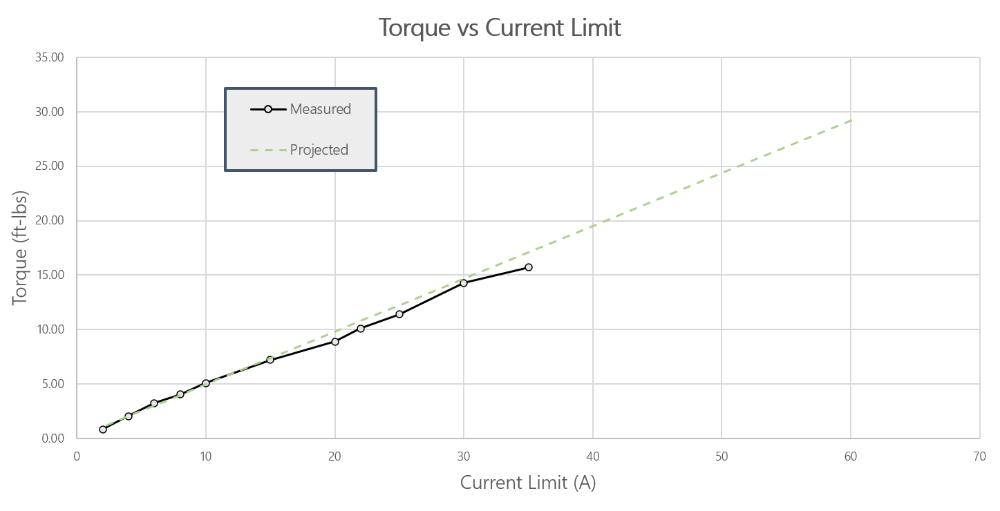
   
  <em>Figure 15: Torque vs Current Limit graph, comparing measured performance against projected linear behavior, highlighting the onset of losses at higher current thresholds, consistent with [existing motor torque literature](https://www.controleng.ca/servosoft/SSHelp1033/source/MotorTorqueVsCurrent.htm).</em>

### Compliance & Backdrivability

* **Methodology:** The actuator's inherent compliance and backdrivability were qualitatively tested at various torque ratings: 4, 7.5, and 14 ft-lb.
* **Results:** Across all tested torque setups, the Shactuator proved to be backdrivable, meaning it could be moved by external forces. Furthermore, it demonstrated excellent damping characteristics after careful tuning of the ODrive controller's gains. As anticipated, backdriving was significantly easier at lower torque settings. This outcome was highly satisfactory, as it successfully proved the actuator's compliance, making it a strong candidate for applications requiring compliant joints, such as a robotic dog.

  
   
  <em>Figure 1: The actuator's compliance when set to exert 7ft-lbs.</em>

  
   
  <em>Figure 1: The Shactuator's compliance when set to exert 15ft-lbs.</em>

### Speed Tests

* **Results:** Performance tests showed that the motor can reach a peak speed of **1920 rpm** before encountering the upper current limit of the desktop power supply. The actuator is capable of maintaining a continuous speed of **1200 rpm** under no-load conditions.
* **Power Supply Configuration:** During these tests, the power supply was set to 24V and its output current limit was set to its maximum of 10A. The motor itself has a peak continuous current rating of 22A.

### Continuous Torque Test

* **Methodology:** To assess the actuator's ability to sustain torque over time, a continuous torque test was devised. Given the motor's specified continuous current limit of 22A, which translates to approximately 10 ft-lbs from our torque graph, a 5lb dumbbell was attached to a weighted band. The Shactuator then performed a series of "robot curls" to evaluate its endurance under continuous load. It showed no signs of performance degredation after 1 minute of operation. NOTE: A house fan was used in this operation as a safety measure to stir the air.

### Backlash Evaluation

* **Results:** Moderate backlash was qualitatively detected in the system. While precise quantification was not possible without a strain gauge, the observed backlash was deemed to be very little, which is a positive indicator for a 3D-printed gearbox. In order to optimize in this future, I will add more preload to the gears when designing them, beefing them up, in essence.

## Challenges & Lessons Learned

Developing the Shactuator provided valuable insights and highlighted several critical challenges inherent in high-performance custom mechatronic systems.

### Power Supply Limitations

During higher current testing, particularly above 30A, the desktop power supply used reached its upper capability limit. This constraint prevented me from fully characterizing the motor's performance at its highest operational currents and understanding its behavior under more extreme loads. Moving forward, a more robust power supply will be essential.

### Material Strain

An early design hurdle emerged at around 15A during torque tests: the PLA printed rod and the round actuator housing, secured by wood clamps, proved unable to maintain stability. This necessitated a quick pivot to reinforce the system. The original PLA rod was reprinted using wood, significantly improving stability for subsequent tests. That is how I landed at the design revision which I uploaded. This experience underscored the importance of material selection and robust mechanical fixturing, especially when pushing 3D printed components to their limits, and suggested potential friction and heat losses in the printed material itself at higher torques.

  
   
  <em>Figure 1: Clamps slipping and failing when I using an earlier revision of the Shactuator. I redesigned the end effector and the housing to accomodate for high load testing.</em>

## Future Improvements

Based on the insights gained from this project, several avenues for future improvement have been identified to enhance the Shactuator's performance and capabilities:

* **Assembly a Robotic Leg:** The whole purpose of this effort was to validate actuator design for a robotic dog. The next big leap will be to put 3 of these actuators in a singular system and simulate the leg of a robotic dog.
* **Reduce Package Size:** This actuator is too big and clunky for a nimble robotic dog, so my next revision will see a more streamlined housing. I will reduce the module of the gears. I believe this will reduce their max torque capability, but we are well within safety for continuous torques.
* **Reduce Backlash:** A key improvement for future revisions will involve increasing the preload in the gear teeth. This mechanical adjustment is expected to significantly reduce the observed backlash, leading to more precise motion control.
* **Enhanced Power Supply:** To fully unlock the EaglePower motor's potential and conduct comprehensive testing beyond 35A, investing in a higher-capacity power supply is a priority.
* **Advanced Control & Thermal Management:** While good damping was achieved, exploring more sophisticated control strategies could further optimize performance. Additionally, integrating a thermistor for continuous temperature monitoring would provide crucial data for thermal management, especially under sustained high-torque operation.
* **Quantitative Data Collection:** Implementing dedicated instrumentation, such as strain gauges, would enable the quantitative measurement of compliance and backlash, providing precise performance metrics that were not achievable in this phase.
